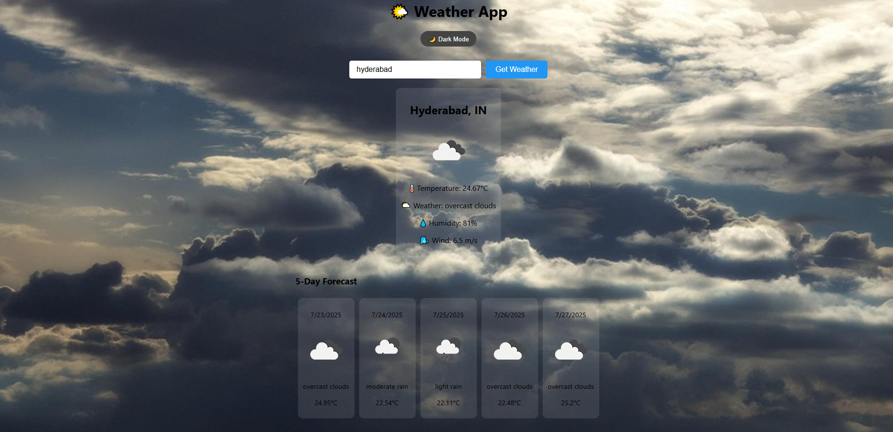
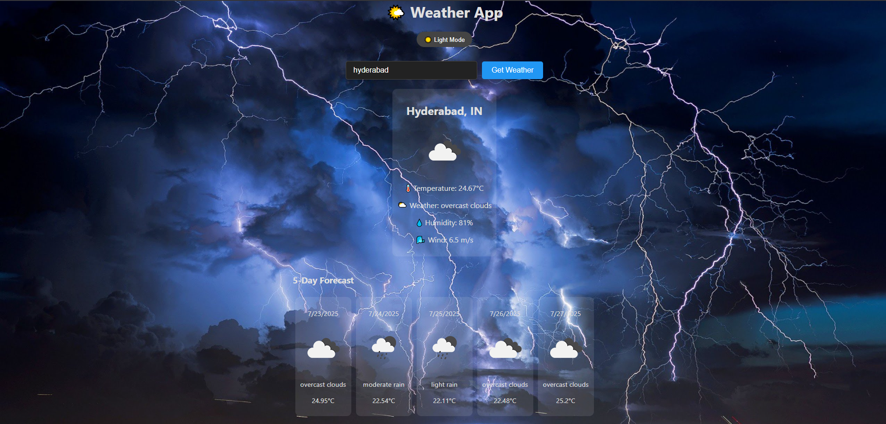

# 🌦️ Weather App - ReactJS

A sleek, responsive weather application built using **React.js** and the **OpenWeatherMap API**. Enter any city to get real-time weather data, with visual cues like animated backgrounds that match current conditions (e.g., clouds when raining), and full dark mode support.


---

## 🚀 Features

- 🌍 **Search Any City:** Get weather updates for any city worldwide
- ☁️ **Live Weather Data:** Temperature, condition, humidity, wind speed
- 🌄 **Dynamic Backgrounds:** Weather-based animated background changes
- 🌙 **Dark Mode Support:** Seamless toggle between light and dark themes
- 📱 **Responsive Design:** Works beautifully on mobile, tablet, and desktop
- 🔄 **Auto Refresh Weather:** Optionally refresh data on interval
- 🧪 **Error Handling:** Friendly error messages for unknown cities or API issues
- 📅 **5 days forecast:** 5-day forecast support
---

## 🛠️ Tech Stack

- [React.js](https://reactjs.org/)
- [OpenWeatherMap API](https://openweathermap.org/api)
- [Axios](https://axios-http.com/) for fetching data
- HTML5 + CSS3 for structure and styling

---

## 🧰 Installation

### Clone the Repo

```bash
git clone https://github.com/wassemashaik/weather-application
cd weather-app
Install Dependencies
npm install

---
Get API Key
Sign up at OpenWeatherMap

Go to your dashboard → API keys

Copy your key

Set up .env
Create a .env file in the root directory:
REACT_APP_WEATHER_API_KEY=your_api_key_here

Run the App: npm start
The app runs on: http://localhost:3000
```
---

## 🌈 Future Enhancements
📍 Detect user's location and show local weather

🗣️ Voice search support

🌡️ Temperature unit toggle (Celsius / Fahrenheit)

🎨 Weather-based icon animations

🌐 Localization (multiple language support)

--- 

📷 Screenshots


